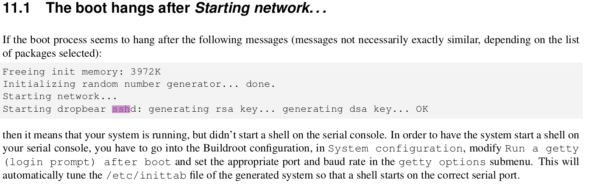
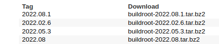
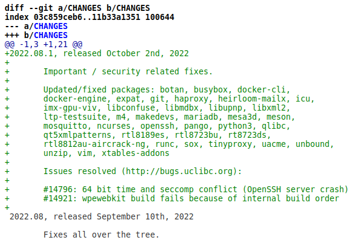

# Técnicas de Programação para Sistemas Embarcados II

## Resolvendo o problema do SSH

### Error: "Connection reset by {ip_da_placa} port {número_da_sua_porta}"

#### Eu estava com esse problema também quando decidir refazer o processo do *buildroot*. Fiquei procurando soluções na *internet* e não achava nada muito concreto, também recorri ao próprio manual *buildroot* e achei o seguinte ao procurar por SSH:

#### Aparentemente, nessa configuração, o sshd (server) está atrelado a um pacote chamado *dropbear*. *Dropbear* é um serviço alternativo de SSH de cliente e servidor, [saiba mais](https://matt.ucc.asn.au/dropbear/dropbear.html). Procurei sobre isso no *buildroot* e tinha um pacote para isso.

#### Também resolvi olhar o [repositório](https://git.buildroot.net/buildroot) da ferramenta para procurar por novas versões e o que havia sido atualizado ou consertado. De acordo com o PDF disponibilizado pelo professor, deveriámos usar a versão **2022.08**. Ao olhar o repositório, vejo que foi lançada um nova *tag/branch* chamada 2022.08.1, atualizada 12 dias atrás (momento em que estou digitando isso).

#### Então resolvi conferir o *commit* que foi feito para essa atualização. Basta clicar no nome **2022.08.1** e depois clicar em ***commit***, terá o seguinte texto em cor verde. 

