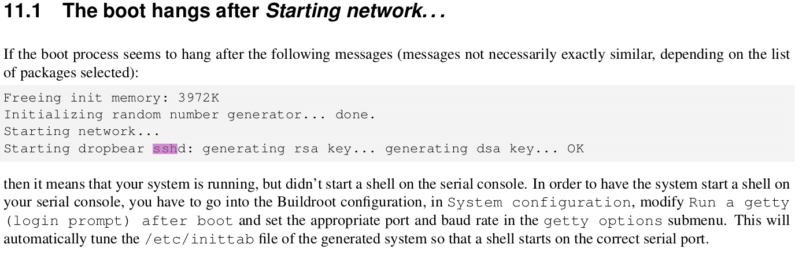
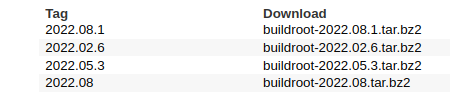
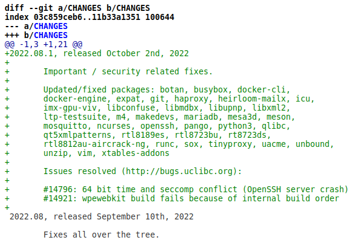
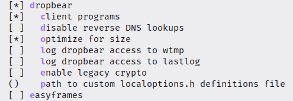
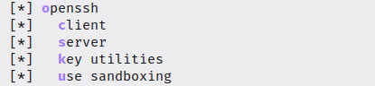
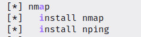
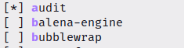
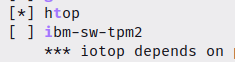
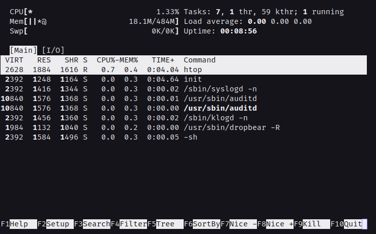

# Técnicas de Programação para Sistemas Embarcados II

- ## O problema do SSH
    ### Error: "Connection reset by {ip_da_placa} port {número_da_sua_porta}"
- ## Buscando a solução
    Eu estava com esse problema também quando decidir refazer o processo do *buildroot*. Fiquei procurando soluções na *internet* e não achava nada muito concreto, também recorri ao próprio manual *buildroot* e achei o seguinte ao procurar por SSH:

    

    Aparentemente, nessa configuração, o sshd (server) está atrelado a um pacote chamado *dropbear*. *Dropbear* é um serviço alternativo de SSH de cliente e servidor, [saiba mais](https://matt.ucc.asn.au/dropbear/dropbear.html). Procurei sobre isso no *buildroot* e tinha um pacote para isso.

- ## Possível solução (funcionou para mim)
    Resolvi olhar o [repositório](https://git.buildroot.net/buildroot) da ferramenta para procurar por novas versões e o que havia sido atualizado ou consertado. De acordo com o PDF disponibilizado pelo professor, deveriámos usar a versão **2022.08**. Ao olhar o repositório, vejo que foi lançada uma nova *tag/branch* chamada **2022.08.1**, atualizada 12 dias atrás (momento em que estou digitando isso).

    

    Então resolvi conferir o *commit* que foi feito para essa atualização. Basta clicar no nome **2022.08.1** e depois clicar em ***commit***, terá o seguinte texto em cor verde. 

    

    Ao ler o texto podemos perceber que vários pacotes foram "*Updated/fixed*" incluindo o *openssh*, ao ver isso resolvi apostar na troca para essa versão e reconfigurar meu *buildroot* baseando-se nela. 

- ## Então vamos para o passo a passo
    ## 1. Atualizar a *branch* criada dentro do repositório com a *branch* mais atual.
    - Certfique-se que você está na *branch* que foi criada no começo da prática

    ```git
    git branch
    ```
    - Vai ser listada todas as *branchs* criadas, a *master* e a sua, se a sua estiver com um * então tá tudo OK. Caso não esteja, execute:
    ```git
    git checkout [nome_da_branch]
    ```

    - Após isso, vamos atualizar em relação ao repositório remoto, execute:
    ```git
    git pull origin 2022.08.1
    ```
    Este comando irá atualizar sua *branch* com a modificações de 2022.08.1

    ## 2. Reconfigurar o *buildroot*

    No meu caso eu executei
    ```bash
    make clean
    ```
    e

    ```bash
    make distclean
    ```
    **Você pode fazer do jeito que bem entender**, se acha que não vale a pena refazer tudo do zero, tudo bem. Eu apenas recomendo isso.

    ## 3. Instale os pacotes necessários

    - Execute o *menuconfig*
    ```bash
    make menuconfig
    ```

    ### 3.1 *Networking applications*
    - Entre em *Target packages*  ---> *Networking applications*  ---> *dropbear* e deixe a seguinte configuração:

    

    - Role mais para baixo e encontre o pacote *openssh* e deixe a seguinte configuração:

    

    - Na mesma seção só que um pouco mais acima, também recomendo a instalação do *nmap* e *nping* 

    

    ### 3.2 *System tools*

    - Após tudo ter sido feito em *Networking applications*, acesse *Target packages*  ---> *System tools*  --->

    - Dentro de *System tools* procurem pelo pacote *audit* e instalem ele. Quando eu estava testando o SSH da minha máquina para a placa a conexão resetava e apresentava um erro no terminal da placa, um erro do tipo:

    ```bash
    [ 1366.978630] audit: type=1326 audit(1422551004.132:2): auid=4294967295 uid=22 gid=22 ses=4294967295 pid=2351 comm="sshd" exe="/usr/sbin/sshd" sig=31 syscall=102 compat=0 ip=0xb7669aa8 code=0x0
    ```
    - Pesquisando mais sobre ele, vi que existe esse pacote no *buildroot*, então fui lá e instalei: 

    

    - Recomendo também a instalação do *htop* logo abaixo:
    
    

    ## 4. Recompile o *buildroot*
    - Para maior velocidade, pesquise quantas *threads* seu processador aguenta (é possível ver esse dado com o comando ***htop***) e coloque esse número na opção *Number of jobs to run simultaneously* dentro de *Build options*, feche tudo e deixe apenas o terminal aberto, pois ele vai puxar muito do computador.

    ### 4.1 Novas imagens e novo *rootfs*
    - Copie as novas imagens para cartão SD, o novo *rootfs* eu recomendo que crie um nova pasta e o descompacte lá. **Lembre-se de criar um novo exports (/etc/exports) para essa nova pasta, além de reiniciar o serviço do nfs**. 
    ### 4.2 Configurando o *sshd_config*
    - Na sua máquina, vá até o novo *filesystem* e execute:
    ```bash
    sudo su
    ```
    - Para entrar como superusuário e execute:
    ```bash
    echo "PermitRootLogin yes" >> etc/ssh/sshd_config
    echo "PermitEmptyPasswords yes" >> etc/ssh/sshd_config
    ```
    - **CUIDADO PARA NÃO ALTERAR O /etc/ DA SUA MÁQUINA, ALTERE NO etc/ DO SISTEMA DE ARQUIVOS DA PLACA**
    
    Nesse caso, **NÃO** precisamos fazer:
    ```bash
    etc/init.d/S50sshd restart
    ```

    Eu fiz assim, mas acredito que possa ser feito de acordo com o PDF da prática, dentro da plaquinha sem problemas, é para surtir o mesmo efeito.
    ## 5. Faça o *boot*
    Espera-se que o processo de boot tenha ocorrido bem. E que antes de ser colocado usuário em senha a mensagem: **Starting dropbear sshd: OK** tenha sido impressa.
    ### 5.1 Olhando os processos que a placa está executando
    - Execute na placa:
    ```bash
    htop
    ```
    - Caso não tenha instalado ele:
    ```bash
    top
    ```
     Procure pelos processos **/usr/sbin/dropbear -R** e **/usr/sbin/auditd**, eles devem está rodando.

    

    Na teoria, o seu SSH está funcionando, apenas resta testá-lo.

    ## 6. Testando o seu SSH

    - Na sua máquina, abra um terminal e execute:
    ```bash
        ssh root@{ip_da_placa}
    ```
    E seja feliz (ou não rsrs).
